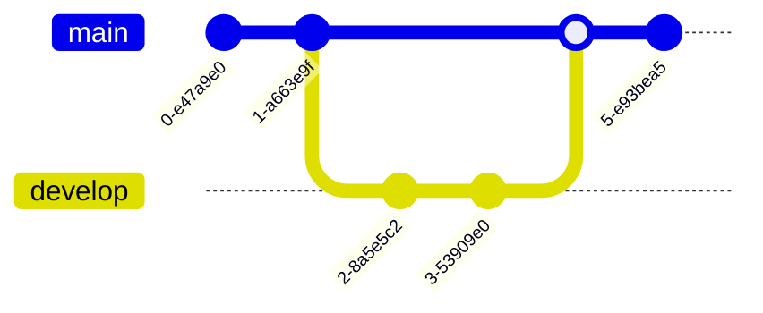
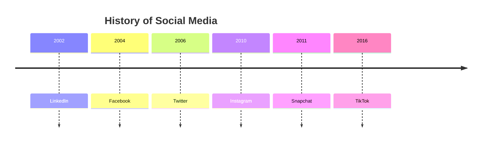
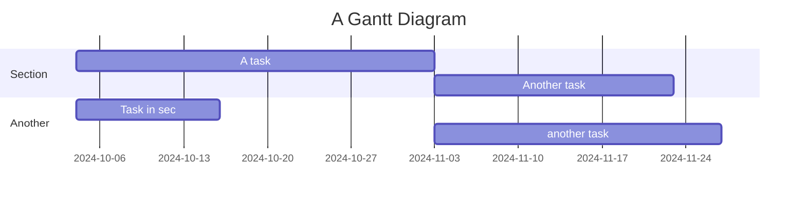

+++
title = 'Markdown'
date = 2024-10-04T13:38:22+02:00
draft = false
+++

Markdown es un lenguaje de marcado ligero que puedes usar para añadir formato a tus documentos de texto. Aquí te mostramos cómo usarlo.

# Encabezado 1

## Encabezado 2

### Encabezado 3

**Este texto está en negrita**
_Este texto está en cursiva_

- Elemento 1
- Elemento 2
- Elemento 3

1. Primer elemento
2. Segundo elemento
3. Tercer elemento

[Enlace a Google](https://www.google.com)


\```
Este es un bloque de código
\```

| Encabezado 1 | Encabezado 2 |
| ------------ | ------------ |
| Fila 1       | Columna 1    |
| Fila 2       | Columna 2    |

> Esta es una cita.

- [x] Tarea completada
- [ ] Tarea pendiente

Este es un ejemplo de `código en línea`.









{}

<!-- 

















 -->

Titulo1
Titulo2
Titulo3
Titulo4
Titulo5
Titulo6
Titulo7
Titulo8
Titulo9
Titulo10
Titulo11
Titulo12
Titulo13
Titulo14
Titulo15
Titulo16
